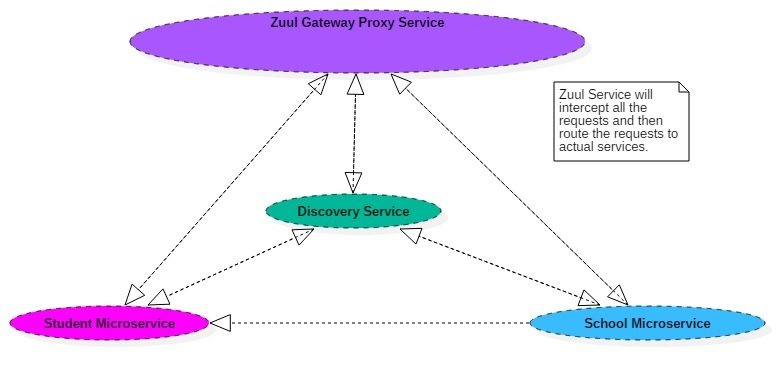
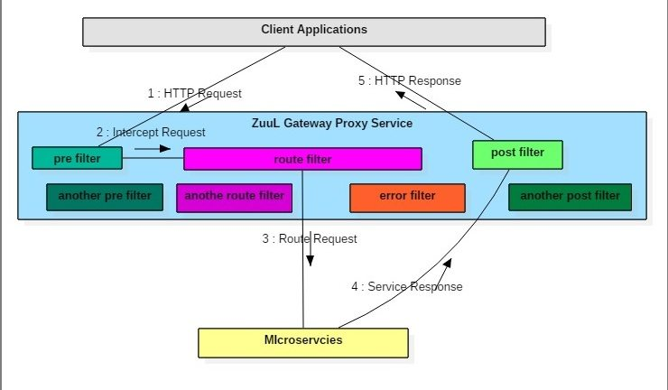

# Spring Boot Microservices

## Step 1  : Create docker images

`mvn clean install dockerfile:build`

## Step 2  : Use Zuul API gateway, Eureka discovery and Feign client to communicate the services running in docker containers.

```
docker network create spring-boot-test
docker container run -p 8761:8761 --network=spring-boot-test --name naming-server kmmanu/service-registry:0.0.2-SNAPSHOT
docker container run -p 8765:8765 --network=spring-boot-test --env SPRING_PROFILES_ACTIVE=prod --name api-gateway-server kmmanu/api-gateway:0.0.1-SNAPSHOT
docker container run -p 8081:8081 --network=spring-boot-test --env SPRING_PROFILES_ACTIVE=prod --name greeting-service kmmanu/greeting-service:0.0.2-SNAPSHOT
docker container run -p 8082:8082 --network=spring-boot-test --env SPRING_PROFILES_ACTIVE=prod --name greeting-client  kmmanu/eureka-client:0.0.3-SNAPSHOT
```

Or use the docker compose :-


```
docker-compose up

```

## Step 3  : Route calls via Zuul gateway.

To call the greeting client via gateway :- `curl http://localhost:8765/greeting-client/client/greeting`

To call the greeting service via gateway :- `curl http://localhost:8765/greeting-service/server/greeting`    

To call the greeting client directly :- `curl http://localhost:8082/client/greeting`  (Not recommended)

To call the greeting server directly :-  `curl http://localhost:8081/server/greeting` (Not recommended)

## Useful commands
```
docker exec -it <greeting_client_container_id>  ping <greeting-service-ip>
docker exec -it <greeting_client_container_id>  ping greeting-service
docker exec -it greeting-service sh
docker container ls
docker container logs <greeting_client_container_id> -f
docker container inspect <greeting_client_container_id>
docker network inspect <network-name>
```

## Service discovery


## Zuul API Gateway



